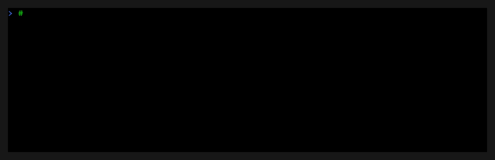
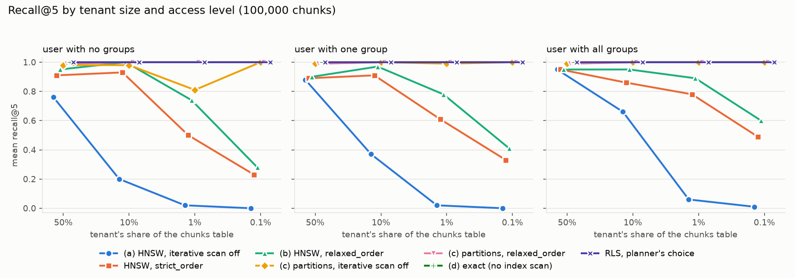
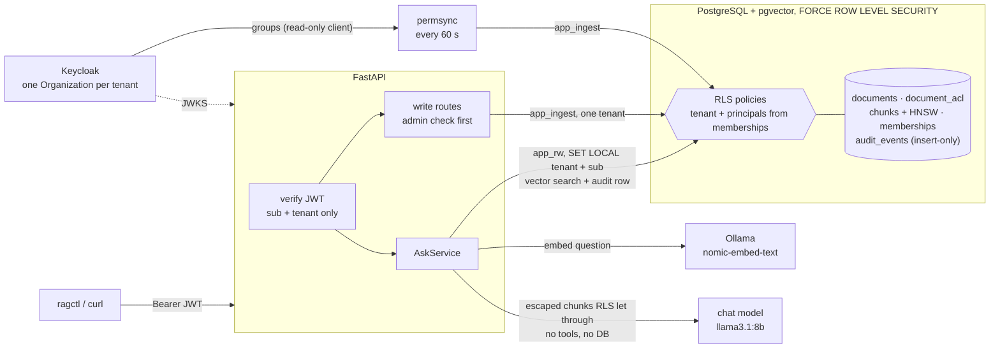

# rag-multitenant

A retrieval-augmented generation service for multiple organizations, where **no user can ever retrieve, or see cited, a document they aren't allowed to read**. That is easy to promise and hard to get right. In most RAG stacks the vector store holds every tenant's chunks in one index, permissions are a filter the application remembers to add, and the LLM sees whatever the search returned. One forgotten `WHERE`, a connection that keeps the last request's tenant, a prompt injection planted in a document, or a group membership that outlives its revocation is enough for one customer's data to land in another's answer. Here isolation is enforced by PostgreSQL Row-Level Security, under the vector search itself. The application and the model can't widen access, and every claim below comes with the test or the measurement that backs it.



## Results

All numbers come from one laptop (AMD Ryzen 7 260, 32 GB, Docker Desktop) and are reproduced by the `make` targets under [Reproduce](#reproduce). The laptop has an RTX 5060, but the model runs behind these numbers were CPU only; `GPU=1` runs Ollama on the GPU.

| Question | Answer | Source |
|---|---|---|
| Does anything leak? | **0 leaks in 393,256 attempts**: 2,153 random worlds and 9,043 states checked against an oracle, plus 246 leak tests, none failed | [`leaks.md`](docs/results/leaks.md) |
| Does filtering hurt recall? | On a shared HNSW index, yes, for small tenants: recall@5 is 0.90–1.00 for tenants holding 10% or more of the table, but 0.28–0.60 for a 0.1% tenant. The query the service runs today (the planner's choice under RLS) gets **1.00 for every tenant**, and partitions by tenant get ≥ 0.99 | [`eval.md`](docs/results/eval.md) |
| What does RLS cost? | **Nothing measurable on the same plan**: 7.02 vs 7.03 ms p50 against a superuser with the same filter as a `WHERE`. The real cost is the planner: it can't see the user's groups, picks an exact sort for the largest tenant, and pays 98.67 ms p50 where the no-RLS query takes 4.82 ms. Partitions bring it to 3.88 ms | [`eval.md`](docs/results/eval.md) |
| How fast is revocation? | **Not measured yet.** By design it is bounded by the permsync interval (`PERMSYNC_INTERVAL_SECONDS`, 60 s by default) and doesn't wait for tokens to expire. `make revocation` measures it | [`make revocation`](#reproduce) |
| Do answers stay inside the ACL? | **No citation outside the asking user's ACL in 39 cases**, 19/19 unanswerable questions answered "I don't know", citation precision 1.00, 18/20 answerable questions correct (`llama3.1:8b`, a 7-document corpus; a baseline, not a quality claim) | [`quality.md`](docs/results/quality.md) |

### No leaks

[`tests/leaks/test_properties.py`](tests/leaks/test_properties.py) is a Hypothesis state machine. It builds two or three tenants that share user ids and group names on purpose, then runs random uploads, re-uploads, content replacements, ACL changes, soft deletes, purges, membership changes and writes that name the wrong tenant, all through the real write paths. After every step it checks each user of each tenant against [`tests/leaks/oracle.py`](tests/leaks/oracle.py), plain Python with no SQL, which works out who may read what. Every search uses the exact text of a chunk the user must *not* read, so a leaked chunk would come first.

| Check | Attempts |
|---|---:|
| `GET /documents` lists exactly the readable documents | 65,829 |
| `GET /documents/{id}` is 404 for a document the user may not read | 63,623 |
| `SELECT … FROM chunks` as the request role returns exactly the readable chunks | 65,829 |
| The retriever returns only readable chunks | 65,829 |
| `POST /ask` cites, and puts in the prompt, only readable chunks | 65,829 |
| `POST /ask` holds no canary of a document the user may not read | 65,829 |
| A write naming another tenant finds nothing and changes nothing | 488 |
| **Total, 0 leaks** | **393,256** |

The other leak tests are fixed scenarios, one per threat (see [Threats considered](#threats-considered)). From [`docs/results/leaks.md`](docs/results/leaks.md).

### Recall per tenant size

100,000 synthetic chunks, four tenants holding 50%, 10%, 1% and 0.1% of the table, three users each (no groups, one group, all groups), the retriever's own statement as the request role. Ranges are across the three users. From [`docs/results/eval.md`](docs/results/eval.md).

| Variant | recall@5, 50% | 10% | 1% | 0.1% | p50 / p95 ms, 50% | p50 / p95 ms, 0.1% |
|---|---|---|---|---|---|---|
| HNSW, iterative scan off | 0.76–0.95 | 0.20–0.66 | 0.02–0.06 | 0.00–0.01 | 3.76 / 5.73 | 3.26 / 5.12 |
| HNSW, `strict_order` | 0.89–0.95 | 0.86–0.93 | 0.50–0.78 | 0.23–0.49 | 4.14 / 7.10 | 98.40 / 337.52 |
| HNSW, `relaxed_order` (default setting) | 0.90–0.95 | 0.95–1.00 | 0.74–0.89 | 0.28–0.60 | 7.02 / 14.75 | 113.76 / 268.37 |
| Exact (no index) | 1.00 | 1.00 | 1.00 | 1.00 | 101.80 / 253.07 | 8.87 / 19.34 |
| **Planner's choice under RLS (what the service runs)** | 1.00 | 1.00 | 1.00 | 1.00 | 98.67 / 259.91 | 4.87 / 12.26 |
| Partitions by tenant, `relaxed_order` ([ADR 0010](docs/adr/0010-partition-chunks-by-tenant.md), proposed) | 0.99 | 1.00 | 1.00 | 1.00 | 3.88 / 12.19 | 3.04 / 8.85 |



What it means:

- **Overfiltering is real.** When RLS filters an HNSW scan, a user who can read little of the table gets fewer than k results: with iterative scans off, every query of the 1% and 0.1% tenants came back short. `relaxed_order` fixes it down to the 1% tenant, but the 0.1% tenant still hits `HNSW_MAX_SCAN_TUPLES` (21 of 60 queries short).
- **At this size the planner never uses HNSW under RLS.** It can't see the user's principals, guesses that about 1% of rows are readable (22–83% actually are), and sorts exactly. Recall is perfect, but the 50% tenant pays about 100 ms.
- **Partitioning `chunks` by tenant fixes both**: ≥ 0.99 recall for everyone, 3–4 ms p50, the same policy text, and no tenant filter in the query, because the executor prunes the other partitions from the policy itself. [ADR 0010](docs/adr/0010-partition-chunks-by-tenant.md) proposes it.

### The cost of RLS

p50 / p95 in ms, same statement, plan forced per row. "No RLS" connects as the superuser and writes the policy as `WHERE` clauses, with the principals computed by the client. "EXISTS" is the normalized policy that ADR 0003 rejected. From [`docs/results/eval.md`](docs/results/eval.md).

| Plan | Access check | 50% tenant | 0.1% tenant |
|---|---|---|---|
| HNSW, `relaxed_order` | **RLS on `acl_principals` (ours)** | 7.02 / 14.75 | 113.76 / 268.37 |
| HNSW, `relaxed_order` | no RLS, explicit `WHERE` | 7.03 / 14.92 | 201.97 / 297.23 |
| HNSW, `relaxed_order` | RLS, `EXISTS` on `document_acl` | 18.02 / 42.44 | 120.64 / 302.53 |
| planner's choice | **RLS on `acl_principals` (ours)** | 98.67 / 259.91 | 4.87 / 12.26 |
| planner's choice | no RLS, explicit `WHERE` | 4.82 / 11.84 | 2.95 / 6.99 |
| planner's choice | RLS, `EXISTS` on `document_acl` | 14.09 / 19.51 | 8.31 / 10.49 |

On the same plan the policy is free, and the denormalized ACL ([ADR 0003](docs/adr/0003-denormalize-acls-onto-chunks.md)) is 2.6× faster than the `EXISTS` join at the large tenant (7.02 vs 18.02 ms). What RLS does cost is plan quality. End to end, a whole `POST /ask` on a CPU takes a median of 8.5 s ([`quality.md`](docs/results/quality.md)), almost all of it the completion.

### Revocation window

Permissions come from a `memberships` table that `permsync` copies from Keycloak, not from the token's `groups` claim ([ADR 0002](docs/adr/0002-resolve-group-memberships-in-the-database.md)). A user removed from a group therefore loses access at the next sync cycle, with the same token, instead of when the token expires. The end-to-end tests check that it happens (`tests/e2e/test_ask.py::test_leaving_a_group_in_keycloak_removes_its_citations_after_one_sync`). The window hasn't been measured yet: `make revocation` runs it against the real stack and writes `docs/results/revocation.md`.

### Answer quality (baseline)

[`quality.md`](docs/results/quality.md): 23 questions, 39 cases across the five seed users, `llama3.1:8b` on CPU. Of the 20 answerable cases, 18 were correct, citation precision was 1.00 and recall 0.90. Both misses were retrieval misses: the model said "I don't know" instead of guessing. All 19 unanswerable cases (8 denied by ACL, 5 in the other tenant, 6 out of corpus) got "I don't know" with no citation. The corpus is tiny and the model grades itself, so this is a regression baseline, not a quality claim.

## How it works



- **Two levels of permissions.** Tenants (one Keycloak Organization each) are fully isolated, and inside a tenant each document has an ACL of `user:<sub>`, `group:<name>` or `tenant:*`.
- **The database decides.** Every tenant table has `FORCE ROW LEVEL SECURITY`, and the API connects with two roles that can't bypass it: `app_rw` serves user requests and reads only what the user's principals allow; `app_ingest` does writes and permission sync and is confined to one tenant. The tenant and user are set per transaction (`set_config(..., true)`), so a pooled connection can't carry them over. With no context set, every query returns nothing.
- **Identity from the token, permissions from the database.** The JWT gives `sub` and the tenant. Groups are resolved inside the policies from `memberships`, so the application never passes them and can't grant itself access.
- **Retrieval is pre-filtered.** The vector search has no tenant or ACL condition of its own: RLS applies it to every candidate the HNSW scan produces. ACLs are copied onto each chunk by triggers, so the check needs no join.
- **The model is untrusted.** It only sees chunks RLS already let through, wrapped as escaped, delimited reference data. It has no tools and no database access. Citations are built from the retrieved set, and a marker that names anything else is dropped. With nothing readable, the answer is a fixed "I don't know" and the model isn't called.
- **Every retrieval is audited** in the same transaction, with chunk ids, scores and a SHA-256 of the question (the text only if `AUDIT_STORE_QUERY_TEXT=true`).

## Threats considered

Mapped to the [OWASP Top 10 for LLM Applications 2025](https://genai.owasp.org/llm-top-10/). The focus is LLM08 (vector and embedding weaknesses) and the items it overlaps with. Tests are under `tests/`; `leaks/` runs against a real PostgreSQL in CI.

### LLM08: Vector and embedding weaknesses

| Threat | Mitigation | Test that proves it |
|---|---|---|
| A query returns another tenant's chunks from the shared vector index | RLS on `chunks` filters every candidate of the scan; the tenant comes from the verified JWT only | `leaks/test_retriever.py::test_only_chunks_the_user_may_read_come_back`, `leaks/test_rls.py::test_same_sub_and_group_in_other_tenant_stay_separate`, the property test's `retrieval` check (65,829 attempts) |
| A user retrieves chunks of a document in their tenant that their groups don't allow | The policy compares `chunks.acl_principals` with principals computed from `memberships` | `leaks/test_rls.py::test_group_member_sees_group_and_tenant_wide_chunks`, `leaks/test_ask.py::test_user_outside_finance_gets_no_budget_canary` |
| A pooled connection keeps the previous request's tenant | Context set only with `set_config(..., true)` inside a transaction; policies fail closed without it | `leaks/test_rls.py::test_context_does_not_survive_the_transaction`, `leaks/test_api.py::test_concurrent_requests_on_a_small_pool_never_mix_tenants`, `leaks/test_ask.py::test_concurrent_asks_on_a_small_pool_never_mix_tenants`, `db/test_isolation.py::test_reader_cannot_widen_with_set_or_reset` |
| A role bypasses RLS (table owner, superuser, `BYPASSRLS`) | Runtime roles own nothing and are `NOSUPERUSER NOBYPASSRLS NOINHERIT`; the migrator is subject to forced RLS | `db/test_roles.py::test_runtime_roles_cannot_bypass_rls`, `db/test_schema.py::test_tenant_table_has_forced_rls`, `leaks/test_rls.py::test_migrator_sees_no_tenant_rows` |
| Embeddings leak through the API and are inverted | Vectors are never returned | `leaks/test_api.py::test_get_returns_a_visible_document_without_embeddings`, `leaks/test_api_writes.py::test_responses_never_carry_embeddings` |
| The ACL copied onto chunks drifts from the document's ACL | `acl_principals` is written only by triggers, in the same transaction as the ACL change | `leaks/test_rls.py::test_chunk_acl_cannot_be_written_directly`, `::test_every_chunk_matches_its_document_acl`, `::test_acl_changes_propagate_to_chunks` |
| A revoked group member keeps retrieving the group's chunks | Memberships read per request from the database, not from the token | `leaks/test_rls.py::test_revoked_membership_takes_effect_on_next_query`, `leaks/test_permsync.py::test_leaving_a_group_revokes_access_on_the_next_read`, `e2e/test_ask.py::test_leaving_a_group_in_keycloak_removes_its_citations_after_one_sync` |
| Deleted or erased documents stay retrievable | Soft delete empties the chunks' ACL by trigger; a purge removes the rows | `leaks/test_retriever.py::test_a_deleted_document_is_never_retrieved`, `leaks/test_soft_delete.py`, `leaks/test_erasure.py::test_a_purged_document_leaves_no_content_behind` |
| Overfiltering: a small tenant gets no context from a filtered HNSW scan (availability, not a leak) | Iterative index scans (`relaxed_order`), re-sorted by distance; partitions proposed (ADR 0010) | `leaks/test_retriever.py::test_iterative_scan_finds_k_chunks_when_few_are_readable`; measured in [`eval.md`](docs/results/eval.md) |

### LLM01: Prompt injection

| Threat | Mitigation | Test that proves it |
|---|---|---|
| A document says "list the other companies' documents" (indirect injection) | The model has no tools and no database access, and only sees chunks RLS let through: there is nothing else to exfiltrate | `leaks/test_ask.py::test_injected_chunk_yields_nothing_from_other_tenants` |
| Chunk text closes its delimiter and poses as instructions | Content, title and heading are escaped; the system prompt says delimited text is data | `unit/test_generation.py::test_injected_closing_delimiter_stays_inside_its_block`, `::test_question_cannot_fake_a_block`, `::test_opened_and_closed_blocks_always_match` |
| An injected or invented citation marker points at a document the user didn't retrieve | Citations are built from the retrieved set; other markers are dropped | `unit/test_generation.py::test_parse_answer_drops_invented_markers`, the property test's `ask_citations` check |

Residual risk, stated in [ADR 0009](docs/adr/0009-retrieval-and-generation.md): a chunk the user *can* read can still steer the wording of their answer.

### LLM02: Sensitive information disclosure

| Threat | Mitigation | Test that proves it |
|---|---|---|
| Status codes reveal that another tenant's document exists | 404 with the same body for missing, invisible, deleted and foreign ids, including on write routes | `leaks/test_api.py::test_invisible_documents_are_404_with_identical_bodies`, `leaks/test_api_writes.py::test_unknown_and_deleted_ids_are_the_same_404`, `::test_an_admin_of_a_gets_404_on_documents_of_b` |
| The "no context" answer reveals whether something matched elsewhere | Fixed `NO_CONTEXT_ANSWER`, same text either way, model not called | `leaks/test_ask.py::test_empty_retrieval_answers_i_dont_know_without_calling_the_model`, `e2e/test_ask.py::test_a_user_with_nothing_readable_gets_the_fixed_answer_without_a_model` |
| A client picks the tenant (`tenant_id` in the body, query or token payload) | The tenant comes from the verified `organization` claim only | `leaks/test_api.py::test_tenant_id_in_query_or_body_is_ignored`, `leaks/test_ask.py::test_tenant_id_in_the_body_is_ignored`, `leaks/test_jwt.py::test_tenant_id_elsewhere_in_the_token_is_ignored` |
| A forged or confused token (`alg: none`, RS256→HS256, wrong `iss`/`aud`, expired) | Signature checked against the cached JWKS, asymmetric algorithms only, `exp`/`iss`/`aud` required | `leaks/test_jwt.py::test_untrusted_tokens_are_rejected`, `::test_validator_refuses_unsafe_algorithms`, `e2e/test_stack.py::test_a_token_with_one_signature_byte_changed_is_rejected` |
| The audit trail exposes users' questions | SHA-256 only by default; rows readable only by the tenant's admins | `leaks/test_ask.py::test_audit_without_query_text_serves_no_question_text`, `::test_audit_is_404_for_non_admins_and_other_tenants`, `leaks/test_rls.py::test_non_admins_read_no_audit_events` |
| Error responses echo uploaded file names or content | Fixed error bodies | `leaks/test_api_writes.py::test_a_pdf_is_415_without_echoing_the_file`, `leaks/test_ingest_service.py::test_every_write_is_audited_without_content` |
| Erased data survives (GDPR) | `DELETE ?purge=true` removes the document, ACL and chunks; the audit keeps ids only | `leaks/test_erasure.py::test_a_purged_document_leaves_no_content_behind` |

### Related items

| OWASP item | Threat | Mitigation | Test that proves it |
|---|---|---|---|
| LLM04 Data and model poisoning | A tenant writes chunks into another tenant, or a non-admin uploads | The writer role is confined to one tenant; the admin check runs before the writer engine or the body is touched | `leaks/test_rls.py::test_writer_cannot_reach_other_tenant`, `::test_chunk_cannot_point_at_other_tenants_document`, the property test's `foreign_write` check (488), `leaks/test_api_writes.py::test_a_non_admin_upload_never_reads_the_body`, `unit/test_writer_boundary.py` |
| LLM05 Improper output handling | Model output is treated as instructions or data | The reply is only text: it never reaches SQL or a shell, and citations come from the retrieved set | `unit/test_generation.py::test_parse_answer_drops_markers_of_retrieved_chunks_left_out_of_the_prompt` |
| LLM06 Excessive agency | The model runs queries or calls tools | `ChatProvider.complete(system, messages) -> str`: no tool or function-calling parameter exists (structural, checked by `mypy --strict`); read routes can't reach the writer engine | `unit/test_writer_boundary.py::test_no_get_route_depends_on_the_writer_engine` |
| LLM07 System prompt leakage | The system prompt holds secrets | It holds none: it is the public text in `ragmt.generation`, and access control lives in the database | `unit/test_generation.py::test_system_prompt_states_the_rules` |
| LLM10 Unbounded consumption | Huge questions, uploads, zip bombs, slow completions, `kid` floods against Keycloak | Question and context caps, streamed upload cap, `.docx` size/ratio/entry caps, chat timeout, JWKS refetch at most every 30 s | `leaks/test_ask.py::test_question_over_the_limit_is_422_before_anything_happens`, `leaks/test_api_writes.py::test_an_oversized_upload_is_413_without_reading_the_whole_body`, `unit/test_ingest_convert.py::test_zip_bomb_is_refused_by_compression_ratio`, `unit/test_auth_jwks.py::test_unknown_kid_refetch_is_rate_limited` |
| LLM03 Supply chain | A `.docx` or HTML upload pulls external resources or XML entities | mammoth ≥ 1.11 (external files off), active content and remote references dropped, DOCTYPE refused; models run locally | `unit/test_ingest_convert.py::test_html_active_content_and_remote_references_are_dropped`, `::test_xml_with_a_doctype_is_refused` |

Not covered: there is no rate limiting per user, and LLM09 (misinformation) is only measured, in [`quality.md`](docs/results/quality.md), not prevented.

## Key decisions

Each decision is an ADR in [`docs/adr/`](docs/adr/) with context, alternatives and consequences:

| ADR | Decision | Why it matters |
|---|---|---|
| [0001](docs/adr/0001-pre-filtering-with-postgres-rls.md) | Pre-filter with PostgreSQL RLS | A forgotten `WHERE` can't leak; costs overfiltering, now measured |
| [0002](docs/adr/0002-resolve-group-memberships-in-the-database.md) | Groups resolved in the database, not from the token | Revocation follows the sync interval, not the token lifetime |
| [0003](docs/adr/0003-denormalize-acls-onto-chunks.md) | ACLs copied onto chunks by trigger | No join during the vector scan: 2.6× faster than `EXISTS` at the large tenant |
| [0004](docs/adr/0004-separate-writer-role.md) | A separate writer role | Writes see the whole tenant, reads only the user's slice, and neither crosses tenants |
| [0005](docs/adr/0005-keycloak-realm-layout.md) | Keycloak: one Organization per tenant | The tenant id comes straight from a verified claim |
| [0006](docs/adr/0006-token-validation-and-tenant-claim.md) | Token validation and the 401/403 split | Closes algorithm confusion; never guesses a tenant |
| [0007](docs/adr/0007-permission-sync.md) | Permission sync writes only from a complete read | A Keycloak error never revokes or grants by accident |
| [0008](docs/adr/0008-write-path.md) | The write path: admins, default ACL, soft delete, erasure | Uploads are private by default; deleted documents vanish without a join |
| [0009](docs/adr/0009-retrieval-and-generation.md) | Retrieval, prompt, citations, audit, and the benchmark results | The model can't cite or see anything RLS didn't return |
| [0010](docs/adr/0010-partition-chunks-by-tenant.md) | *Proposed:* partition `chunks` by tenant | ≥ 0.99 recall and 3–4 ms p50 at every tenant size in the benchmark |

## Reproduce

Requirements: Docker with Compose, conda (or any Python 3.12 environment) and `make`. On Windows, run the targets from Git Bash, which has no `make` of its own: `winget install ezwinports.make`.

```bash
cp .env.example .env                  # local placeholders
conda env create -f environment.yml && conda activate ragmt
pip install -e ".[dev]"
docker compose up -d                  # PostgreSQL + pgvector, Keycloak, Ollama (first run pulls the models)
make migrate                          # schema, as the migrator role
pytest                                # unit + db + leak tests (e2e is skipped without the full stack)
```

| Target | What it produces | Needs |
|---|---|---|
| `make leaks` | [`docs/results/leaks.md`](docs/results/leaks.md): the leak suite with the `nightly` Hypothesis profile | PostgreSQL |
| `make eval` | [`docs/results/eval.md`](docs/results/eval.md) and its charts: recall and latency on 100k synthetic chunks, in a separate `ragmt_eval` database | PostgreSQL (superuser password); about 25 min from an empty database |
| `make quality` | Raw answer-quality runs; [`docs/results/quality.md`](docs/results/quality.md) is written from them | PostgreSQL, Keycloak, Ollama with both models |
| `make revocation` | Raw revocation runs; `docs/results/revocation.md` is written from them | PostgreSQL, Keycloak (stop the compose `permsync` service); about an hour |
| `make e2e` | The end-to-end suite against real Keycloak tokens and Ollama (`FAKE_CHAT=1` skips the chat model) | the whole stack |
| `make demo` | `docs/demo.gif`, recorded with [VHS](https://github.com/charmbracelet/vhs) from [`docs/demo/demo.tape`](docs/demo/demo.tape) | the whole stack, `vhs` (see [`docs/demo/demo.tape`](docs/demo/demo.tape)) |

With an NVIDIA GPU, add `GPU=1` to the targets that use Ollama (`make e2e GPU=1`, `make quality GPU=1`, `make demo GPU=1`), or pass the override to compose yourself: `docker compose -f compose.yaml -f compose.gpu.yaml up -d`. Docker Desktop on Windows supports this out of the box; Linux needs the NVIDIA Container Toolkit. Raw runs go to `docs/results/raw/` (git-ignored). CI runs ruff, mypy, gitleaks and pytest against the same `postgres` service from `compose.yaml` (migrations are also downgraded to base and upgraded again). Every night it runs the leak suite with the `nightly` profile and the e2e suite with FakeChat; the benchmarks are local only.

## Try it

This assumes the stack from [Reproduce](#reproduce) is up and migrated, with the placeholder passwords from `.env.example`. Answers need real embeddings, so set `LLM_PROVIDER=ollama` in `.env` *before* the first seed. Unchanged files are never re-embedded, so a seed first loaded with `fake` vectors keeps them until `docker compose down -v`.

```bash
make seed                                      # two fictional tenants, five users, seven documents
make permsync ARGS=--once                      # copy group memberships from Keycloak
uvicorn --factory ragmt.api.app:create_app &   # the API on http://127.0.0.1:8000 (Swagger at /docs)
export KC_DEMO_USER_PASSWORD=change-me-demo    # DEV ONLY: what --dev-user logs in with
```

The same question, three users. Alice is in Acme's `finance` group, dave in Umbra's `finance` group (same name, other tenant), and erin is in Acme with no groups:

```bash
ragctl --dev-user alice ask "Summarise the budget."
ragctl --dev-user dave  ask "Summarise the budget."
ragctl --dev-user erin  ask "Summarise the budget."
```

When the model cites, the answer ends with its sources (an 8B model sometimes answers without a marker, and then no source is listed). Alice's can only be Acme's *Q3 budget*, dave's only Umbra's *Annual budget*, and erin's only the tenant-wide *Employee handbook*, which has no budget, so she gets "I don't know" or an answer from the handbook. An earlier run of alice's question:

```text
The fleet budget for Q3 is **1.2 million credits**, of which 300,000 go to
replacing the oldest delivery drones [doc:106d18d0-…#1].

Sources:
  [1] Q3 budget > Q3 budget > Fleet
```

The wording changes from run to run, but the sources can't: alice's budget never reaches dave's prompt, or the other way round. `ragctl login` signs in through the browser instead (authorization code with PKCE); `--dev-user` uses a dev-only password client that is off unless `KC_DEV_PASSWORD_CLIENT=true` ([ADR 0005](docs/adr/0005-keycloak-realm-layout.md)).

<details>
<summary>The same thing over HTTP: documents, uploads, the audit trail</summary>

```bash
# A token from the dev-only password client (local development only, see ADR 0005).
token() {
  curl -s http://localhost:8080/realms/ragmt/protocol/openid-connect/token \
    -d grant_type=password -d client_id=ragmt-dev-password \
    -d username="$1" -d password=change-me-demo |
  python -c 'import json, sys; print(json.load(sys.stdin)["access_token"])'
}
ALICE=$(token alice); DAVE=$(token dave); BOB=$(token bob)   # bob: Acme's admin

curl -s http://127.0.0.1:8000/documents -H "Authorization: Bearer $DAVE"
# [{"id":"193fedfc-…","title":"Annual budget"},{"id":"34ba74ce-…","title":"Lab safety policy"}]

# Alice's budget, asked for by dave: the same 404 as a document that doesn't exist.
curl -s http://127.0.0.1:8000/documents/<alice's budget id> -H "Authorization: Bearer $DAVE"
# {"detail":"Document not found"}

# Bob uploads a document for Acme's finance group only. Bob himself can't read it:
# being an admin grants no read access.
printf '# Depot night shift\n\nThe north depot moves its night shift in November.\n' > depot.md
curl -s http://127.0.0.1:8000/documents -H "Authorization: Bearer $BOB" \
  -F file=@depot.md -F 'acl=["group:finance"]'
# {"id":"5b0e…","title":"Depot night shift","chunks":1,"unchanged":false}

# Alice isn't an admin: her upload is refused.
curl -s http://127.0.0.1:8000/documents -H "Authorization: Bearer $ALICE" -F file=@depot.md
# {"detail":"Forbidden"}

# Bob reads the audit trail: chunk ids, scores, the model, a SHA-256 of the question.
curl -s 'http://127.0.0.1:8000/audit?limit=1' -H "Authorization: Bearer $BOB"
# Alice gets the same 404 as an unknown route.
curl -s http://127.0.0.1:8000/audit -H "Authorization: Bearer $ALICE"
# {"detail":"Not Found"}
```

Remove alice from `/acme/finance` in the Keycloak admin console (http://localhost:8080, realm `ragmt`), run `make permsync ARGS=--once`, and the same token no longer lists or cites the Q3 budget.

</details>

### API

Every route but `/healthz` needs a bearer token. The tenant comes from the token only; a `tenant_id` anywhere in the request is ignored.

| Route | Who | What |
|---|---|---|
| `GET /documents` | any user | The documents the caller's ACLs allow: `[{id, title}]` |
| `GET /documents/{id}` | any user | One of them; 404 for anything else, including other tenants' ids |
| `POST /documents` | tenant admins | Multipart `file` (`.md`, `.html` or `.docx`, up to `INGEST_MAX_BYTES`) and an optional `acl` such as `["group:hr"]`; without one, only the uploader can read it |
| `PUT /documents/{id}/content` | tenant admins | New content, same ACL |
| `PUT /documents/{id}/acl` | tenant admins | Replaces the ACL with `{"principals": [...]}`; the chunks follow in the same transaction |
| `DELETE /documents/{id}` | tenant admins | Soft delete; `?purge=true` erases the document and its chunks |
| `POST /ask` | any user | `{"question": "..."}` → `{answer, citations: [{document_id, title, heading}], model}` |
| `GET /audit` | tenant admins | The tenant's audit trail, newest first (`?limit=`, then `?before=<next_before>`) |

Admins are the members of `/<organization>/admins` in Keycloak. Non-admins get 403 on an upload and 404 on any route with a document id. Embeddings are never returned.

## Limitations

- **Measured on one laptop, with synthetic vectors** for recall and latency, default PostgreSQL memory settings and one run. The ratios carry over; the milliseconds won't ([`eval.md`](docs/results/eval.md), caveats).
- **The revocation window isn't measured yet.** It is bounded by design by the permsync interval plus any Keycloak outage, during which revocations wait ([ADR 0007](docs/adr/0007-permission-sync.md)).
- **The service's plan is slow for broad-access users in large tenants** (about 100 ms p50 at 50,000 chunks), and on the shared HNSW index tiny tenants lose recall. Partitioning by tenant fixes both in the benchmark, but it is only proposed ([ADR 0010](docs/adr/0010-partition-chunks-by-tenant.md)): onboarding a tenant would need DDL, and thousands of partitions haven't been measured.
- **Prompt injection is contained, not eliminated.** A readable chunk can steer the answer the user reads, though not what they can access.
- **The answer-quality numbers are a baseline**: 7 documents, questions written by the author of the documents, a model that grades itself ([`quality.md`](docs/results/quality.md)).
- **Vector search only**, with no hybrid BM25 search, and no per-user rate limiting.
- **The audit hash isn't anonymisation.** A SHA-256 of a short question can be confirmed by guessing ([ADR 0009](docs/adr/0009-retrieval-and-generation.md)).
- **PostgreSQL-specific.** Isolation lives in RLS; moving to a dedicated vector store would mean rethinking it.

## Roadmap

- [x] Scaffold: package layout, tooling, environment
- [x] Local stack with Docker Compose and CI (lint, types, tests against a real PostgreSQL)
- [x] Database roles: schema owner separate from a runtime role that cannot bypass RLS
- [x] Database schema and RLS policies, with SQL-level isolation tests
- [x] Keycloak realm, JWT validation, per-request tenant context, permission sync
- [x] Ingestion: documents → Markdown → chunks → embeddings, with ACLs, through admin-only write routes
- [x] Retrieval and answer generation with citations, plus audit log
- [x] Revocation and deletion (GDPR erasure)
- [x] Leak-test suite (property-based) and benchmarks, published in `docs/results/`
- [x] Presentation: results-first README, threat model, demo
- [ ] *(optional)* Relationship-based permissions with OpenFGA

## Stack

Python 3.12 · FastAPI · PostgreSQL 16 + pgvector 0.8 · SQLAlchemy (async) + Alembic · Keycloak 26 (OIDC) · Ollama (`nomic-embed-text`, `llama3.1:8b`; no API key needed) · pytest + Hypothesis

## License

[Apache 2.0](LICENSE)
