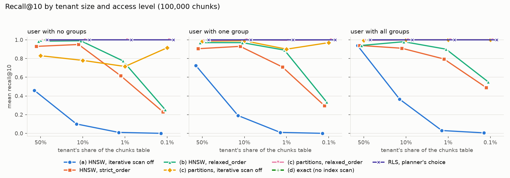
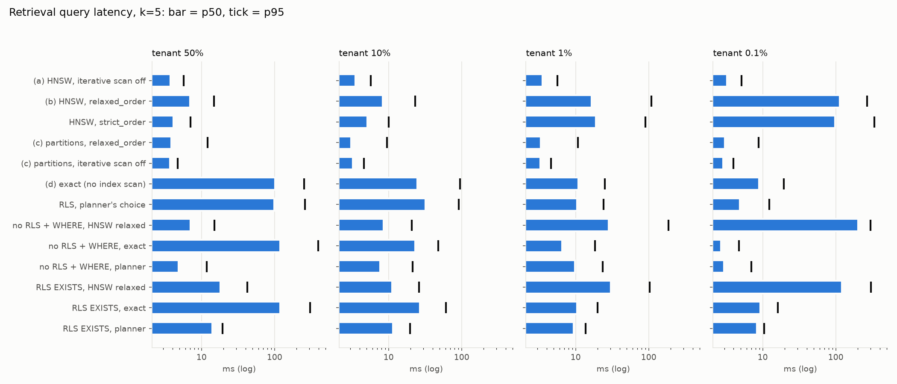
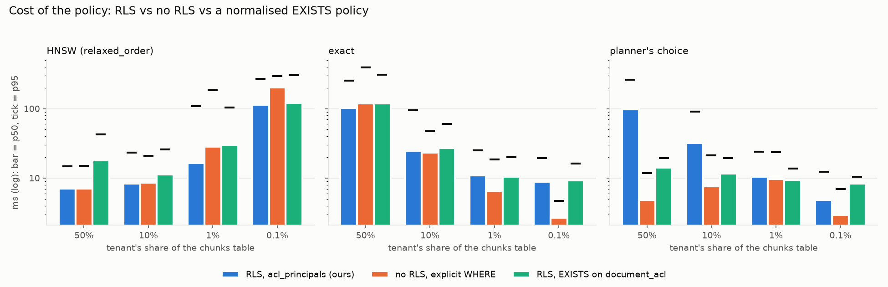

# Retrieval benchmarks

Generated by `python -m eval.report` from `docs/results/raw/eval-20261007T222150Z` (git 6c4b410 (dirty)). `make eval` reproduces it; ADR 0009 (Results) says what the numbers change. Method: `eval/bench.py`, corpus: `eval/corpus.py`.

## Setup

- **Host:** AMD Ryzen 7 260 w/ Radeon 780M Graphics, 16 logical CPUs, 31.3 GiB RAM, Windows-11-10.0.26200-SP0.
- **Docker:** 29.6.1 on Docker Desktop, VM with 16 CPUs and 15.3 GiB.
- **Database:** PostgreSQL 16.10 (Debian 16.10-1.pgdg12+1), pgvector 0.8.0, the compose image with its defaults: shared_buffers 128MB, work_mem 4MB, effective_cache_size 4GB, max_parallel_workers_per_gather 2, jit on. Sizes: chunks 816 MB, chunks_by_tenant 810 MB, chunks_embedding_hnsw_idx 391 MB, chunks_normalized 804 MB.
- **Client:** Python 3.12.14, numpy 2.5.3, asyncpg over localhost into the container.
- **Corpus:** `eval.corpus`, 100,000 chunks, seed 42, 768 dimensions, 50 topics shared by all tenants, spread 1.0, 10 chunks per document, 8 users per tenant, ACL mix (tenant:*, group, user) (0.2, 0.6, 0.2). Four filler tenants make up the rest of the table. 20 query vectors per tenant, each run for three users.
- **HNSW:** the index from the migrations (m 16, ef_construction 64), ef_search 40, max_scan_tuples 20000 (the service's defaults). Scratch indexes are built the same way.
- **Runs:** per variant, one warm-up pass, one pass at k=10 (recall@10), 5 timed passes at k=5 (latency, recall@5 from the first). Latency is the client's wall time of the search statement only.
- **Duration:** 15 min for this run (corpus already loaded).

Chunks per tenant, and chunks each measured user may read:

| tenant | chunks | no groups | one group | all groups |
|---|---|---|---|---|
| 50% (`share-50`) | 50,000 | 11,250 | 18,750 | 41,250 |
| 10% (`share-10`) | 10,000 | 2,250 | 3,750 | 8,250 |
| 1% (`share-1`) | 1,000 | 230 | 380 | 830 |
| 0.1% (`share-0.1`) | 100 | 30 | 40 | 90 |

Variants (all run the retriever's statement; plans forced per transaction):

| name | label | table | role | plan | iterative scan |
|---|---|---|---|---|---|
| `hnsw_off` | (a) HNSW, iterative scan off | `chunks` | app_rw | hnsw (enable_seqscan=off, enable_bitmapscan=off, enable_sort=off, jit=off) | off |
| `hnsw_relaxed` | (b) HNSW, relaxed_order | `chunks` | app_rw | hnsw (enable_seqscan=off, enable_bitmapscan=off, enable_sort=off, jit=off) | relaxed_order |
| `hnsw_strict` | HNSW, strict_order | `chunks` | app_rw | hnsw (enable_seqscan=off, enable_bitmapscan=off, enable_sort=off, jit=off) | strict_order |
| `partition_relaxed` | (c) partitions, relaxed_order | `eval_scratch.chunks_by_tenant` | app_rw | hnsw (enable_seqscan=off, enable_bitmapscan=off, enable_sort=off, jit=off) | relaxed_order |
| `partition_off` | (c) partitions, iterative scan off | `eval_scratch.chunks_by_tenant` | app_rw | hnsw (enable_seqscan=off, enable_bitmapscan=off, enable_sort=off, jit=off) | off |
| `exact` | (d) exact (no index scan) | `chunks` | app_rw | exact (enable_indexscan=off, enable_indexonlyscan=off, jit=off) | relaxed_order |
| `planner` | RLS, planner's choice | `chunks` | app_rw | planner | relaxed_order |
| `baseline_hnsw` | no RLS + WHERE, HNSW relaxed | `chunks` | superuser | hnsw (enable_seqscan=off, enable_bitmapscan=off, enable_sort=off, jit=off) | relaxed_order |
| `baseline_exact` | no RLS + WHERE, exact | `chunks` | superuser | exact (enable_indexscan=off, enable_indexonlyscan=off, jit=off) | relaxed_order |
| `baseline_planner` | no RLS + WHERE, planner | `chunks` | superuser | planner | relaxed_order |
| `exists_hnsw` | RLS EXISTS, HNSW relaxed | `eval_scratch.chunks_normalized` | app_rw | hnsw (enable_seqscan=off, enable_bitmapscan=off, enable_sort=off, jit=off) | relaxed_order |
| `exists_exact` | RLS EXISTS, exact | `eval_scratch.chunks_normalized` | app_rw | exact (enable_indexscan=off, enable_indexonlyscan=off, jit=off) | relaxed_order |
| `exists_planner` | RLS EXISTS, planner | `eval_scratch.chunks_normalized` | app_rw | planner | relaxed_order |

Forced plans: every forced variant used the plan it forces (checked with EXPLAIN on each tenant and user).

## Recall@5

| variant | access | 50% | 10% | 1% | 0.1% |
|---|---|---|---|---|---|
| (a) HNSW, iterative scan off | no groups | 0.760 | 0.200 | 0.020 | 0.000 |
| (a) HNSW, iterative scan off | one group | 0.880 | 0.370 | 0.020 | 0.000 |
| (a) HNSW, iterative scan off | all groups | 0.950 | 0.660 | 0.060 | 0.010 |
| HNSW, strict_order | no groups | 0.910 | 0.930 | 0.500 | 0.230 |
| HNSW, strict_order | one group | 0.890 | 0.910 | 0.610 | 0.330 |
| HNSW, strict_order | all groups | 0.950 | 0.860 | 0.780 | 0.490 |
| (b) HNSW, relaxed_order | no groups | 0.950 | 1.000 | 0.740 | 0.280 |
| (b) HNSW, relaxed_order | one group | 0.900 | 0.970 | 0.780 | 0.410 |
| (b) HNSW, relaxed_order | all groups | 0.950 | 0.950 | 0.890 | 0.600 |
| (c) partitions, iterative scan off | no groups | 0.980 | 0.980 | 0.810 | 1.000 |
| (c) partitions, iterative scan off | one group | 0.990 | 1.000 | 0.990 | 1.000 |
| (c) partitions, iterative scan off | all groups | 0.990 | 1.000 | 1.000 | 1.000 |
| (c) partitions, relaxed_order | no groups | 0.990 | 1.000 | 1.000 | 1.000 |
| (c) partitions, relaxed_order | one group | 0.990 | 1.000 | 1.000 | 1.000 |
| (c) partitions, relaxed_order | all groups | 0.990 | 1.000 | 1.000 | 1.000 |
| (d) exact (no index scan) | no groups | 1.000 | 1.000 | 1.000 | 1.000 |
| (d) exact (no index scan) | one group | 1.000 | 1.000 | 1.000 | 1.000 |
| (d) exact (no index scan) | all groups | 1.000 | 1.000 | 1.000 | 1.000 |
| RLS, planner's choice | no groups | 1.000 | 1.000 | 1.000 | 1.000 |
| RLS, planner's choice | one group | 1.000 | 1.000 | 1.000 | 1.000 |
| RLS, planner's choice | all groups | 1.000 | 1.000 | 1.000 | 1.000 |

Queries that came back short (fewer than min(k, readable) rows), k=5:

| variant | 50% | 10% | 1% | 0.1% |
|---|---|---|---|---|
| (a) HNSW, iterative scan off | 14/60 | 54/60 | 60/60 | 60/60 |
| HNSW, strict_order | 0/60 | 0/60 | 0/60 | 23/60 |
| (b) HNSW, relaxed_order | 0/60 | 0/60 | 0/60 | 21/60 |
| (c) partitions, iterative scan off | 1/60 | 2/60 | 7/60 | 0/60 |
| (c) partitions, relaxed_order | 0/60 | 0/60 | 0/60 | 0/60 |
| (d) exact (no index scan) | 0/60 | 0/60 | 0/60 | 0/60 |
| RLS, planner's choice | 0/60 | 0/60 | 0/60 | 0/60 |

## Recall@10

| variant | access | 50% | 10% | 1% | 0.1% |
|---|---|---|---|---|---|
| (a) HNSW, iterative scan off | no groups | 0.460 | 0.100 | 0.010 | 0.000 |
| (a) HNSW, iterative scan off | one group | 0.725 | 0.190 | 0.010 | 0.000 |
| (a) HNSW, iterative scan off | all groups | 0.940 | 0.365 | 0.030 | 0.005 |
| HNSW, strict_order | no groups | 0.930 | 0.950 | 0.615 | 0.230 |
| HNSW, strict_order | one group | 0.905 | 0.930 | 0.710 | 0.295 |
| HNSW, strict_order | all groups | 0.940 | 0.910 | 0.795 | 0.490 |
| (b) HNSW, relaxed_order | no groups | 0.985 | 0.990 | 0.775 | 0.255 |
| (b) HNSW, relaxed_order | one group | 0.970 | 0.970 | 0.890 | 0.335 |
| (b) HNSW, relaxed_order | all groups | 0.940 | 0.980 | 0.900 | 0.550 |
| (c) partitions, iterative scan off | no groups | 0.830 | 0.780 | 0.715 | 0.915 |
| (c) partitions, iterative scan off | one group | 0.985 | 0.990 | 0.900 | 0.970 |
| (c) partitions, iterative scan off | all groups | 0.995 | 1.000 | 1.000 | 1.000 |
| (c) partitions, relaxed_order | no groups | 0.995 | 1.000 | 1.000 | 1.000 |
| (c) partitions, relaxed_order | one group | 0.990 | 1.000 | 0.995 | 1.000 |
| (c) partitions, relaxed_order | all groups | 0.995 | 1.000 | 1.000 | 1.000 |
| (d) exact (no index scan) | no groups | 1.000 | 1.000 | 1.000 | 1.000 |
| (d) exact (no index scan) | one group | 1.000 | 1.000 | 1.000 | 1.000 |
| (d) exact (no index scan) | all groups | 1.000 | 1.000 | 1.000 | 1.000 |
| RLS, planner's choice | no groups | 1.000 | 1.000 | 1.000 | 1.000 |
| RLS, planner's choice | one group | 1.000 | 1.000 | 1.000 | 1.000 |
| RLS, planner's choice | all groups | 1.000 | 1.000 | 1.000 | 1.000 |

Queries that came back short (fewer than min(k, readable) rows), k=10:

| variant | 50% | 10% | 1% | 0.1% |
|---|---|---|---|---|
| (a) HNSW, iterative scan off | 35/60 | 60/60 | 60/60 | 60/60 |
| HNSW, strict_order | 0/60 | 0/60 | 0/60 | 41/60 |
| (b) HNSW, relaxed_order | 0/60 | 0/60 | 0/60 | 38/60 |
| (c) partitions, iterative scan off | 15/60 | 13/60 | 13/60 | 8/60 |
| (c) partitions, relaxed_order | 0/60 | 0/60 | 0/60 | 0/60 |
| (d) exact (no index scan) | 0/60 | 0/60 | 0/60 | 0/60 |
| RLS, planner's choice | 0/60 | 0/60 | 0/60 | 0/60 |

## Latency (k=5)

p50 / p95 in ms, over 3 users x 20 queries x 5 passes per cell:

| variant | 50% | 10% | 1% | 0.1% | recall@5, all cells |
|---|---|---|---|---|---|
| (a) HNSW, iterative scan off | 3.76 / 5.73 | 3.50 / 5.68 | 3.53 / 5.64 | 3.26 / 5.12 | 0.328 |
| (b) HNSW, relaxed_order | 7.02 / 14.75 | 8.36 / 23.14 | 16.58 / 108.80 | 113.76 / 268.37 | 0.785 |
| HNSW, strict_order | 4.14 / 7.10 | 5.12 / 10.03 | 19.00 / 90.52 | 98.40 / 337.52 | 0.699 |
| (c) partitions, relaxed_order | 3.88 / 12.19 | 3.07 / 9.51 | 3.34 / 10.74 | 3.04 / 8.85 | 0.998 |
| (c) partitions, iterative scan off | 3.70 / 4.69 | 3.24 / 4.62 | 3.31 / 4.59 | 2.88 / 3.97 | 0.978 |
| (d) exact (no index scan) | 101.80 / 253.07 | 24.68 / 95.54 | 10.90 / 25.10 | 8.87 / 19.34 | 1.000 |
| RLS, planner's choice | 98.67 / 259.91 | 31.83 / 91.15 | 10.51 / 24.02 | 4.87 / 12.26 | 1.000 |
| no RLS + WHERE, HNSW relaxed | 7.03 / 14.92 | 8.56 / 20.88 | 28.31 / 185.84 | 201.97 / 297.23 | 0.785 |
| no RLS + WHERE, exact | 119.78 / 396.40 | 23.15 / 47.70 | 6.52 / 18.48 | 2.69 / 4.73 | 1.000 |
| no RLS + WHERE, planner | 4.82 / 11.84 | 7.66 / 21.28 | 9.75 / 23.58 | 2.95 / 6.99 | 0.977 |
| RLS EXISTS, HNSW relaxed | 18.02 / 42.44 | 11.25 / 25.97 | 30.17 / 103.70 | 120.64 / 302.53 | 0.812 |
| RLS EXISTS, exact | 118.72 / 306.82 | 26.93 / 60.80 | 10.46 / 20.05 | 9.27 / 16.12 | 1.000 |
| RLS EXISTS, planner | 14.09 / 19.51 | 11.54 / 19.57 | 9.41 / 13.70 | 8.31 / 10.49 | 0.981 |

Per access level, largest tenant (50%) and smallest (0.1%):

| variant | 50%, no groups | 50%, one group | 50%, all groups | 0.1%, no groups | 0.1%, one group | 0.1%, all groups |
|---|---|---|---|---|---|---|
| (a) HNSW, iterative scan off | 4.59 / 6.00 | 3.78 / 5.53 | 3.40 / 4.25 | 4.43 / 5.40 | 3.04 / 4.19 | 3.11 / 4.36 |
| (b) HNSW, relaxed_order | 7.79 / 18.44 | 5.69 / 12.71 | 5.74 / 10.64 | 112.73 / 277.37 | 113.18 / 154.07 | 114.83 / 281.81 |
| HNSW, strict_order | 5.80 / 8.00 | 4.03 / 5.17 | 3.61 / 4.43 | 122.25 / 344.20 | 91.50 / 124.96 | 98.40 / 284.48 |
| (c) partitions, relaxed_order | 3.98 / 11.66 | 3.81 / 12.12 | 3.84 / 12.42 | 3.09 / 8.74 | 3.01 / 9.23 | 3.05 / 8.89 |
| (c) partitions, iterative scan off | 3.73 / 5.77 | 3.59 / 4.41 | 3.82 / 4.62 | 2.83 / 3.98 | 2.85 / 4.00 | 2.91 / 3.63 |
| (d) exact (no index scan) | 58.48 / 123.34 | 95.45 / 193.88 | 237.23 / 262.10 | 4.72 / 10.35 | 7.66 / 12.24 | 15.91 / 20.82 |
| RLS, planner's choice | 56.68 / 125.64 | 94.74 / 189.47 | 237.92 / 494.90 | 3.35 / 4.95 | 4.80 / 6.64 | 10.00 / 13.87 |
| no RLS + WHERE, HNSW relaxed | 10.24 / 16.39 | 6.89 / 11.53 | 6.61 / 9.48 | 238.13 / 296.94 | 214.04 / 297.23 | 184.33 / 294.37 |
| no RLS + WHERE, exact | 62.60 / 137.09 | 105.32 / 205.34 | 259.41 / 542.17 | 3.94 / 5.10 | 2.22 / 2.85 | 2.58 / 3.32 |
| no RLS + WHERE, planner | 6.09 / 15.69 | 4.56 / 10.66 | 3.54 / 8.04 | 3.95 / 7.55 | 2.23 / 6.31 | 2.52 / 6.36 |
| RLS EXISTS, HNSW relaxed | 20.02 / 28.77 | 13.69 / 28.99 | 18.08 / 44.89 | 126.24 / 283.52 | 118.68 / 319.66 | 114.65 / 282.35 |
| RLS EXISTS, exact | 79.25 / 150.45 | 109.04 / 144.06 | 273.84 / 384.66 | 9.18 / 15.83 | 9.09 / 14.91 | 10.05 / 16.28 |
| RLS EXISTS, planner | 13.83 / 18.45 | 13.55 / 17.96 | 15.62 / 21.18 | 8.24 / 10.71 | 8.14 / 10.03 | 8.69 / 10.59 |

### The cost of the policy

p50 / p95 in ms. Same statement and plan; the baseline connects as the superuser (no RLS) and adds the policy as WHERE clauses with the principals computed by the client; the EXISTS variant reads `eval_scratch.chunks_normalized` with a policy that checks `document_acl` per row instead of `acl_principals`.

| plan | access check | 50% | 10% | 1% | 0.1% |
|---|---|---|---|---|---|
| HNSW (relaxed_order) | RLS, acl_principals (ours) | 7.02 / 14.75 | 8.36 / 23.14 | 16.58 / 108.80 | 113.76 / 268.37 |
| HNSW (relaxed_order) | no RLS, explicit WHERE | 7.03 / 14.92 | 8.56 / 20.88 | 28.31 / 185.84 | 201.97 / 297.23 |
| HNSW (relaxed_order) | RLS, EXISTS on document_acl | 18.02 / 42.44 | 11.25 / 25.97 | 30.17 / 103.70 | 120.64 / 302.53 |
| exact | RLS, acl_principals (ours) | 101.80 / 253.07 | 24.68 / 95.54 | 10.90 / 25.10 | 8.87 / 19.34 |
| exact | no RLS, explicit WHERE | 119.78 / 396.40 | 23.15 / 47.70 | 6.52 / 18.48 | 2.69 / 4.73 |
| exact | RLS, EXISTS on document_acl | 118.72 / 306.82 | 26.93 / 60.80 | 10.46 / 20.05 | 9.27 / 16.12 |
| planner's choice | RLS, acl_principals (ours) | 98.67 / 259.91 | 31.83 / 91.15 | 10.51 / 24.02 | 4.87 / 12.26 |
| planner's choice | no RLS, explicit WHERE | 4.82 / 11.84 | 7.66 / 21.28 | 9.75 / 23.58 | 2.95 / 6.99 |
| planner's choice | RLS, EXISTS on document_acl | 14.09 / 19.51 | 11.54 / 19.57 | 9.41 / 13.70 | 8.31 / 10.49 |

## Caveats

- One machine, one run, Docker Desktop's VM, PostgreSQL's default memory settings (shared_buffers 128MB: the HNSW index doesn't fit, so warm runs read from the VM's page cache). Absolute milliseconds will differ elsewhere; the ratios are the point.
- Synthetic vectors (clustered random unit vectors), not nomic-embed-text output. Recall depends on the distribution; the comparison between variants is what carries over.
- The scratch tables are static copies whose HNSW indexes were built in one pass; `public.chunks`' index was built row by row during the load. Under the same plan and filter, the EXISTS table's index reaches a slightly different recall than `public.chunks`' (see the recall@5 column), which bounds how much of a scratch variant's recall comes from the build rather than the design.
- Eight tenants, so eight partitions (plus an empty default). Thousands of tenants would mean thousands of partitions and indexes, which this run doesn't measure.
- Latency includes the localhost round trip and the parsing of the 768-float literal, which is the floor of every variant (about 3 ms here).

## Plans

EXPLAIN (ANALYZE, BUFFERS) of the first query at k=5, per tenant (users collapsed when their plan is the same). Full JSON in `plans.jsonl`.

| variant | tenant | users | CTE scan | rows removed | buffers |
|---|---|---|---|---|---|
| `hnsw_off` | 50% | no groups, one group, all groups | `Index Scan chunks_embedding_hnsw_idx` | 7..38 | 980..994 |
| `hnsw_off` | 10% | no groups, one group, all groups | `Index Scan chunks_embedding_hnsw_idx` | 37..40 | 1,008..1,043 |
| `hnsw_off` | 1% | no groups, one group, all groups | `Index Scan chunks_embedding_hnsw_idx` | 39..40 | 985..1,000 |
| `hnsw_off` | 0.1% | no groups, one group, all groups | `Index Scan chunks_embedding_hnsw_idx` | 40 | 965 |
| `hnsw_relaxed` | 50% | no groups, one group, all groups | `Index Scan chunks_embedding_hnsw_idx` | 7..40 | 985..1,416 |
| `hnsw_relaxed` | 10% | no groups, one group, all groups | `Index Scan chunks_embedding_hnsw_idx` | 76..221 | 1,698..2,237 |
| `hnsw_relaxed` | 1% | no groups, one group, all groups | `Index Scan chunks_embedding_hnsw_idx` | 500..1,393 | 3,061..4,964 |
| `hnsw_relaxed` | 0.1% | no groups, one group, all groups | `Index Scan chunks_embedding_hnsw_idx` | 6,426..20,062 | 32,653..46,220 |
| `hnsw_strict` | 50% | no groups, one group, all groups | `Index Scan chunks_embedding_hnsw_idx` | 7..40 | 985..1,416 |
| `hnsw_strict` | 10% | no groups, one group, all groups | `Index Scan chunks_embedding_hnsw_idx` | 76..339 | 1,698..2,583 |
| `hnsw_strict` | 1% | no groups, one group, all groups | `Index Scan chunks_embedding_hnsw_idx` | 494..1,383 | 3,055..4,954 |
| `hnsw_strict` | 0.1% | no groups, one group, all groups | `Index Scan chunks_embedding_hnsw_idx` | 9,639..19,251 | 35,864..45,411 |
| `partition_relaxed` | 50% | no groups, one group, all groups | `Merge Append > Index Scan p_share_50_embedding_idx` (8 partitions pruned) | 2..19 | 806..820 |
| `partition_relaxed` | 10% | no groups, one group, all groups | `Merge Append > Index Scan p_share_10_embedding_idx` (8 partitions pruned) | 5..19 | 402..412 |
| `partition_relaxed` | 1% | no groups, one group, all groups | `Merge Append > Index Scan p_share_1_embedding_idx` (8 partitions pruned) | 0..6 | 533..536 |
| `partition_relaxed` | 0.1% | no groups, one group, all groups | `Merge Append > Index Scan p_share_0_1_embedding_idx` (8 partitions pruned) | 0..28 | 176..207 |
| `partition_off` | 50% | no groups, one group, all groups | `Merge Append > Index Scan p_share_50_embedding_idx` (8 partitions pruned) | 2..19 | 806..820 |
| `partition_off` | 10% | no groups, one group, all groups | `Merge Append > Index Scan p_share_10_embedding_idx` (8 partitions pruned) | 5..19 | 402..412 |
| `partition_off` | 1% | no groups, one group, all groups | `Merge Append > Index Scan p_share_1_embedding_idx` (8 partitions pruned) | 0..6 | 533..536 |
| `partition_off` | 0.1% | no groups, one group, all groups | `Merge Append > Index Scan p_share_0_1_embedding_idx` (8 partitions pruned) | 0..28 | 176..207 |
| `exact` | 50% | no groups, one group, all groups | `Sort (top-N heapsort) > Bitmap Heap Scan chunks > BitmapAnd > Bitmap Index Scan chunks_acl_principals_idx > Bitmap Index Scan chunks_tenant_id_idx` | 0 | 45,950..166,323 |
| `exact` | 10% | no groups, one group, all groups | `Sort (top-N heapsort) > Bitmap Heap Scan chunks > BitmapAnd > Bitmap Index Scan chunks_acl_principals_idx > Bitmap Index Scan chunks_tenant_id_idx` | 0 | 9,225..33,318 |
| `exact` | 1% | no groups, one group, all groups | `Sort (top-N heapsort) > Bitmap Heap Scan chunks > BitmapAnd > Bitmap Index Scan chunks_tenant_id_idx > Bitmap Index Scan chunks_acl_principals_idx` | 0 | 960..3,399 |
| `exact` | 0.1% | no groups, one group, all groups | `Sort (top-N heapsort) > Bitmap Heap Scan chunks > BitmapAnd > Bitmap Index Scan chunks_tenant_id_idx > Bitmap Index Scan chunks_acl_principals_idx` | 0 | 170..437 |
| `planner` | 50% | no groups, one group, all groups | `Sort (top-N heapsort) > Bitmap Heap Scan chunks > BitmapAnd > Bitmap Index Scan chunks_acl_principals_idx > Bitmap Index Scan chunks_tenant_id_idx` | 0 | 45,947..166,323 |
| `planner` | 10% | no groups, one group, all groups | `Sort (top-N heapsort) > Bitmap Heap Scan chunks > BitmapAnd > Bitmap Index Scan chunks_acl_principals_idx > Bitmap Index Scan chunks_tenant_id_idx` | 0 | 9,222..33,318 |
| `planner` | 1% | no groups, one group, all groups | `Sort (top-N heapsort) > Bitmap Heap Scan chunks > BitmapAnd > Bitmap Index Scan chunks_tenant_id_idx > Bitmap Index Scan chunks_acl_principals_idx` | 0 | 981..3,417 |
| `planner` | 0.1% | no groups, one group, all groups | `Sort (top-N heapsort) > Bitmap Heap Scan chunks > BitmapAnd > Bitmap Index Scan chunks_tenant_id_idx > Bitmap Index Scan chunks_acl_principals_idx` | 0 | 167..437 |
| `baseline_hnsw` | 50% | no groups, one group, all groups | `Index Scan chunks_embedding_hnsw_idx` | 7..40 | 979..1,413 |
| `baseline_hnsw` | 10% | no groups, one group, all groups | `Index Scan chunks_embedding_hnsw_idx` | 76..221 | 1,692..2,234 |
| `baseline_hnsw` | 1% | no groups, one group, all groups | `Index Scan chunks_embedding_hnsw_idx` | 500..1,393 | 3,055..4,958 |
| `baseline_hnsw` | 0.1% | no groups, one group, all groups | `Index Scan chunks_embedding_hnsw_idx` | 6,426..20,062 | 32,635..46,219 |
| `baseline_exact` | 50% | no groups, one group, all groups | `Sort (top-N heapsort) > Bitmap Heap Scan chunks > Bitmap Index Scan chunks_acl_principals_idx` | 10,015..40,025 | 46,689..167,467 |
| `baseline_exact` | 10% | no groups, one group, all groups | `Sort (top-N heapsort) > Bitmap Heap Scan chunks > Bitmap Index Scan chunks_tenant_id_idx` | 1,750..7,750 | 9,278..33,278 |
| `baseline_exact` | 1% | no groups, one group, all groups | `Sort (top-N heapsort) > Bitmap Heap Scan chunks > BitmapAnd > Bitmap Index Scan chunks_tenant_id_idx > Bitmap Index Scan chunks_acl_principals_idx` | 0 | 978..3,411 |
| `baseline_exact` | 0.1% | no groups | `Sort (top-N heapsort) > Bitmap Heap Scan chunks > BitmapAnd > Bitmap Index Scan chunks_tenant_id_idx > Bitmap Index Scan chunks_acl_principals_idx` | 0 | 152 |
| `baseline_exact` | 0.1% | one group, all groups | `Sort (top-N heapsort) > Bitmap Heap Scan chunks > Bitmap Index Scan chunks_tenant_id_idx` | 10..60 | 185..385 |
| `baseline_planner` | 50% | no groups, one group, all groups | `Index Scan chunks_embedding_hnsw_idx` | 7..40 | 979..1,413 |
| `baseline_planner` | 10% | no groups, one group, all groups | `Index Scan chunks_embedding_hnsw_idx` | 76..221 | 1,692..2,234 |
| `baseline_planner` | 1% | no groups, one group, all groups | `Sort (top-N heapsort) > Bitmap Heap Scan chunks > BitmapAnd > Bitmap Index Scan chunks_tenant_id_idx > Bitmap Index Scan chunks_acl_principals_idx` | 0 | 978..3,411 |
| `baseline_planner` | 0.1% | no groups | `Sort (top-N heapsort) > Bitmap Heap Scan chunks > BitmapAnd > Bitmap Index Scan chunks_tenant_id_idx > Bitmap Index Scan chunks_acl_principals_idx` | 0 | 152 |
| `baseline_planner` | 0.1% | one group, all groups | `Sort (top-N heapsort) > Index Scan chunks_tenant_id_idx` | 10..60 | 185..385 |
| `exists_hnsw` | 50% | no groups, one group, all groups | `Index Scan chunks_normalized_embedding_hnsw_idx > Index Scan document_acl_pkey` | 1,042..4,011 | 3,690..9,548 |
| `exists_hnsw` | 10% | no groups, one group, all groups | `Index Scan chunks_normalized_embedding_hnsw_idx > Index Scan document_acl_pkey` | 2,022..7,280 | 4,380..10,140 |
| `exists_hnsw` | 1% | no groups, one group, all groups | `Index Scan chunks_normalized_embedding_hnsw_idx > Index Scan document_acl_pkey` | 3,354..8,421 | 7,050..11,471 |
| `exists_hnsw` | 0.1% | no groups, one group, all groups | `Index Scan chunks_normalized_embedding_hnsw_idx > Index Scan document_acl_pkey` | 6,453..20,259 | 33,093..46,897 |
| `exists_exact` | 50% | no groups, one group, all groups | `Sort (top-N heapsort) > Bitmap Heap Scan chunks_normalized > Bitmap Index Scan chunks_normalized_tenant_id_idx > Seq Scan document_acl` | 14,627..47,627 | 46,006..166,006 |
| `exists_exact` | 10% | no groups, one group, all groups | `Sort (top-N heapsort) > Bitmap Heap Scan chunks_normalized > Bitmap Index Scan chunks_normalized_tenant_id_idx > Seq Scan document_acl` | 10,927..17,527 | 9,317..33,317 |
| `exists_exact` | 1% | no groups, one group, all groups | `Sort (top-N heapsort) > Bitmap Heap Scan chunks_normalized > Bitmap Index Scan chunks_normalized_tenant_id_idx > Seq Scan document_acl` | 10,089..10,749 | 1,058..3,464 |
| `exists_exact` | 0.1% | no groups, one group, all groups | `Sort (top-N heapsort) > Bitmap Heap Scan chunks_normalized > Bitmap Index Scan chunks_normalized_tenant_id_idx > Seq Scan document_acl` | 10,003..10,069 | 254..482 |
| `exists_planner` | 50% | no groups, one group, all groups | `Index Scan chunks_normalized_embedding_hnsw_idx > Seq Scan document_acl` | 5,884..8,917 | 1,078..1,511 |
| `exists_planner` | 10% | no groups, one group, all groups | `Index Scan chunks_normalized_embedding_hnsw_idx > Seq Scan document_acl` | 9,253..9,997 | 1,771..2,299 |
| `exists_planner` | 1% | no groups, one group, all groups | `Sort (top-N heapsort) > Bitmap Heap Scan chunks_normalized > Bitmap Index Scan chunks_normalized_tenant_id_idx > Seq Scan document_acl` | 10,089..10,749 | 1,078..3,482 |
| `exists_planner` | 0.1% | no groups, one group, all groups | `Sort (top-N heapsort) > Index Scan chunks_normalized_tenant_id_idx > Seq Scan document_acl` | 10,003..10,069 | 250..482 |
